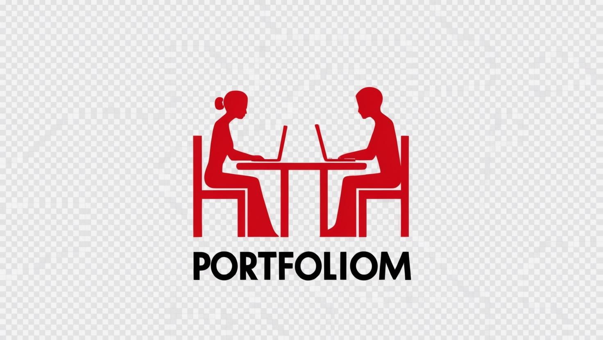

# PortfolioM - Profesyonel Portfolyo Yönetim Platformu

  
   
  
<em>"Yeteneklerinizi Gösterin, Projelerinizi Paylaşın, CV’nizi Oluşturun!"</em>

## Genel Bakış

PortfolioM, yazılımcıların projelerini kolayca kategorilere ayırarak sergileyebileceği, deneyimlerini paylaşabileceği ve profesyonel bağlantılar kurabileceği kapsamlı bir platformdur. Projelerinizi sürükle-bırak yöntemiyle hızlıca güncelleyebilirsiniz. Ayrıca, projelerinizi etiketleyip, teknoloji yığınlarıyla birlikte tanıtarak daha geniş kitlelere ulaştırabilirsiniz. Platform, yazılımcıların portföylerini oluşturmak, yeteneklerini sergilemek ve CV'lerini dinamik olarak oluşturmak için mükemmel bir araçtır. Ayrıca, profesyonel ağınızı genişletmek için projeleriniz hakkında geri bildirim alabilir ve diğer yazılımcılarla işbirlikleri yapabilirsiniz.

## Canlı Demo

[Canlı Demo](https://www.portfoliom.dev) üzerinden PortfolioM'u keşfedin.

## Temel Özellikler

### Profesyonel Profil Yönetimi

- Özelleştirilebilir profil sayfaları
- Yetenek görselleştirme
- Deneyim zaman çizelgesi
- Dinamik CV oluşturma
- Profesyonel iletişim yönetimi

### Proje Vitrini

- Çoklu görsel proje sunumu
- Teknoloji yığını etiketleme
- Proje kategorilendirme
- İnteraktif proje galerileri
- Canlı proje bağlantıları

### Modern Kullanıcı Arayüzü

- Açık/Koyu tema desteği
- Duyarlı tasarım
- Sezgisel gezinme
- Akıcı animasyonlar
- Profesyonel estetik

### Topluluk Özellikleri

- Kullanıcı arama işlevi
- Proje yorumları (gelecek)
- Profesyonel ağ oluşturma (gelecek)
- Yetenek onayları (gelecek)
- Proje işbirliği (gelecek)

## Neden PortfolioM?

- Profesyonel Görünüm: Öne çıkan etkileyici bir dijital portfolyo oluşturun
- Kolay Yönetim: Profesyonel içeriğinizi yönetmek için sezgisel arayüz
- Modern Teknoloji: En son web teknolojileriyle inşa edilmiş

## Ekran Görüntüleri

### 1. Anasayfa Profil

  

  

### 2. Projeler - Proje Ekle
Proje listenizi dilediğiniz gibi özelleştirin. Projelerinizi sürükle-bırak yöntemiyle kolayca güncelleyebilir ve düzenleyebilirsiniz. Projelerinizi kategorilere ayırarak diğer kullanıcılarla paylaşabilir, yeteneklerinizi en iyi şekilde sergileyebilirsiniz. Hangi projeyi daha önce göstermek isterseniz, o projeyi en üst sıraya taşıyabilirsiniz.

  

### 3. CV Oluştur

  

  

### 4. Profil Sayfası

  

### 5. Profil Düzenle

  

  

### 6. Giriş Ekranı

  

### 7. Proje Ekle

  

### 8. Sistem Mimarisi

  

## Güvenlik Özellikleri

- JWT tabanlı kimlik doğrulama
- Rol tabanlı erişim kontrolü
- Güvenli dosya yüklemeleri
- Korumalı API uç noktaları
- Cross-Origin Resource Sharing
- OAuth2 entegrasyonu

## Kimler İçin İdeal?

- Yazılım Geliştiriciler

## API Dokümantasyonu

PortfolioM, kapsamlı bir RESTful API sunmaktadır. API dokümantasyonuna [Swagger UI](https://portfoliom-is7q.onrender.com/swagger-ui/index.html#/) üzerinden erişebilirsiniz.

### API Endpoint Grupları

#### Kimlik Doğrulama (Auth)
- `POST /api/v1/auth/login` - Kullanıcı girişi
- `POST /api/v1/auth/register` - Yeni kullanıcı kaydı

#### Kullanıcı İşlemleri (User)
- `GET /api/v1/users/{username}` - Kullanıcı bilgilerini getirme
- `PUT /api/v1/users/update` - Kullanıcı bilgilerini güncelleme
- `PATCH /api/v1/users/upload-photo` - Profil fotoğrafı yükleme
- `PATCH /api/v1/users/upload-cv` - CV yükleme
- `PATCH /api/v1/users/add-skill` - Yetenek ekleme
- `PATCH /api/v1/users/add-contact` - İletişim bilgisi ekleme

#### Proje Yönetimi (Project)
- `GET /api/v1/projects/user/{userId}` - Kullanıcının projelerini getirme
- `POST /api/v1/projects/create` - Yeni proje oluşturma
- `PUT /api/v1/projects/{id}` - Proje güncelleme
- `DELETE /api/v1/projects/{id}` - Proje silme
- `PUT /api/v1/projects/reorder` - Proje sıralamasını güncelleme

#### Yorum Yönetimi (Comment)
- `POST /api/v1/comments/{projectId}` - Projeye yorum ekleme
- `PUT /api/v1/comments/{id}` - Yorum güncelleme
- `DELETE /api/v1/comments/{id}` - Yorum silme
- `GET /api/v1/comments/project/{id}` - Projenin yorumlarını getirme

#### Deneyim Yönetimi (Experience)
- `GET /api/v1/experiences/{username}` - Kullanıcının deneyimlerini getirme
- `PUT /api/v1/experiences/{id}` - Deneyim güncelleme
- `DELETE /api/v1/experiences/{id}` - Deneyim silme

### API Güvenliği

- JWT tabanlı kimlik doğrulama
- Role-based yetkilendirme (USER, ADMIN)
- Güvenli dosya yükleme işlemleri
- CORS yapılandırması
- Rate limiting

### API Özellikleri

- RESTful mimari
- JSON veri formatı
- HTTP durum kodları
- İstek/yanıt doğrulama
- Hata yönetimi
- Sayfalama ve sıralama desteği

Detaylı API dokümantasyonu için [Swagger UI](https://portfoliom-is7q.onrender.com/swagger-ui/index.html#/) sayfasını ziyaret edin.

## Kullanılan Teknolojiler ve Dağıtım

### Backend Core
- Java 17
- Spring Boot 3.3.5
- Maven

### Veritabanı & Cache
- PostgreSQL
- Redis (Upstash)
- JPA/Hibernate

### Güvenlik
- Spring Security
- JWT (JSON Web Token)
- OAuth2 Client

### Cloud Servisler
- Cloudinary (Dosya Depolama)

### API & Dokümantasyon
- RESTful API
- OpenAPI/Swagger

### Performans & Ölçeklendirme
- Bucket4j (Rate Limiting)
- Redis Cache

**Dağıtım ve Barındırma:**  
PortfolioM, modern teknolojilerle inşa edilmiştir. Proje, Cloudinary ile dosya yönetimi ve Render üzerinden Dockerize edilerek deploy edilmiştir. Backend, Supabase üzerinde PostgreSQL veritabanıyla barındırılmakta, Redis Upstash üzerinde bulunmakta, frontend ise Vercel üzerinde dağıtılmaktadır. Tüm deploy işlemleri tamamen ücretsiz ve verimli bir şekilde yapılmaktadır.
